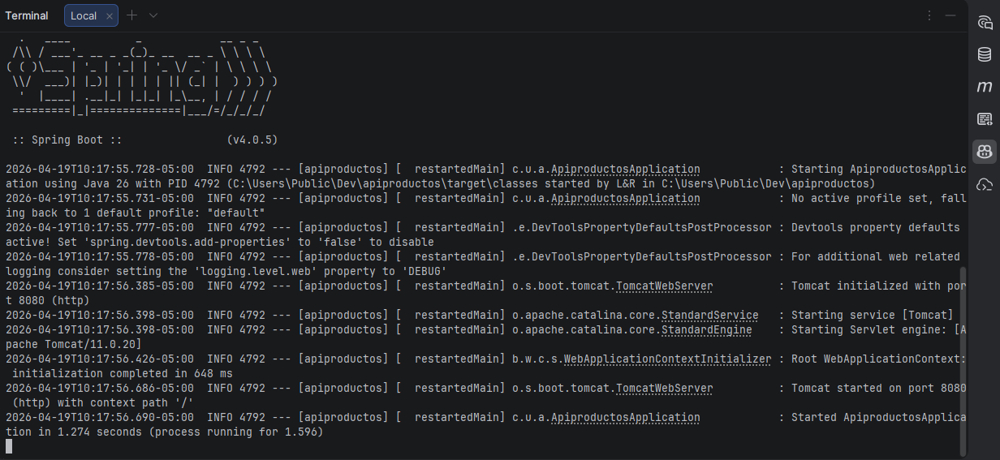
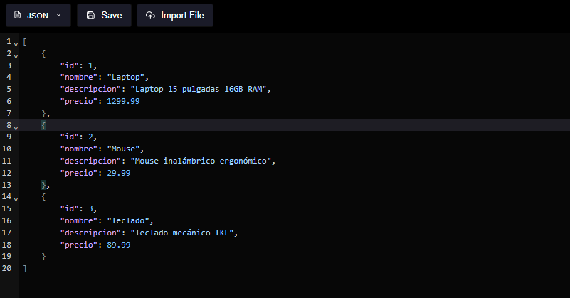
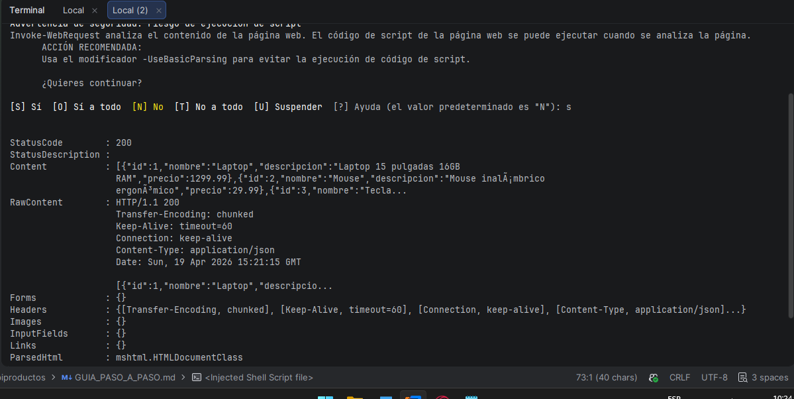
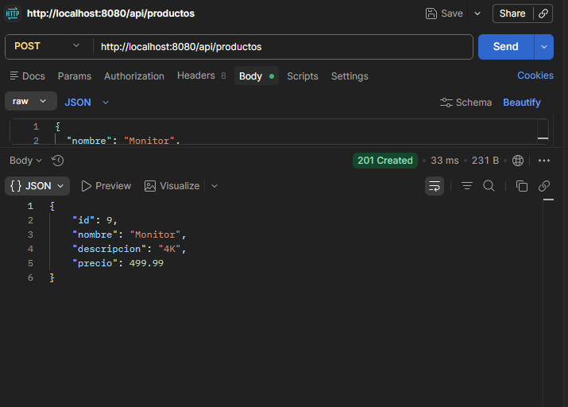
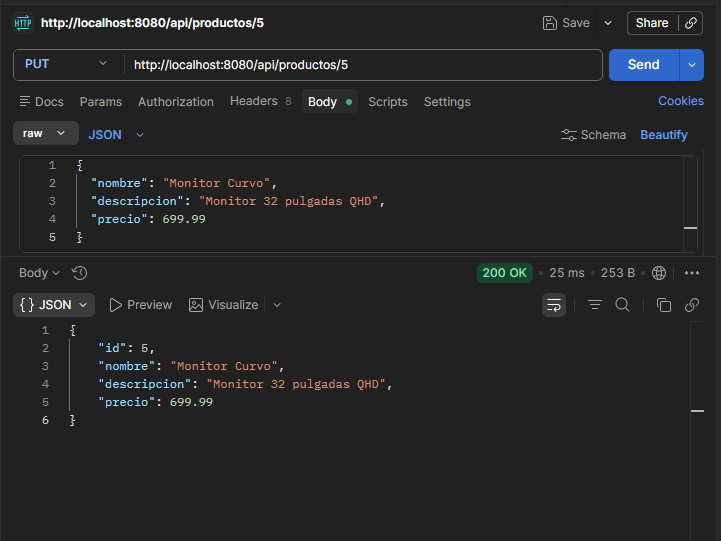
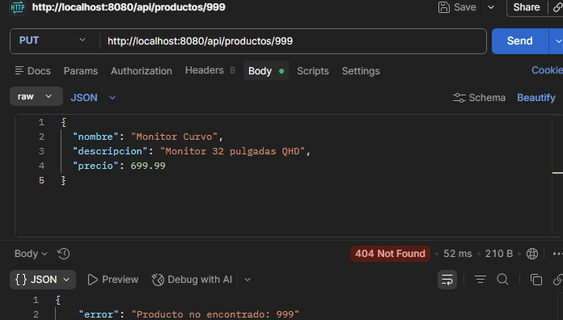
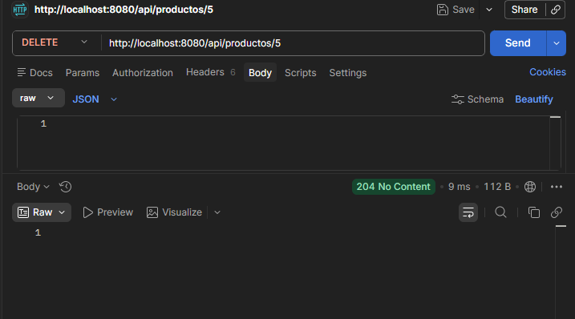
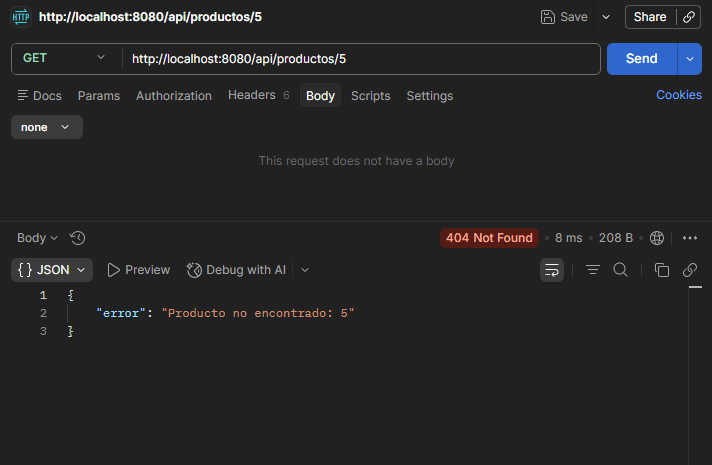
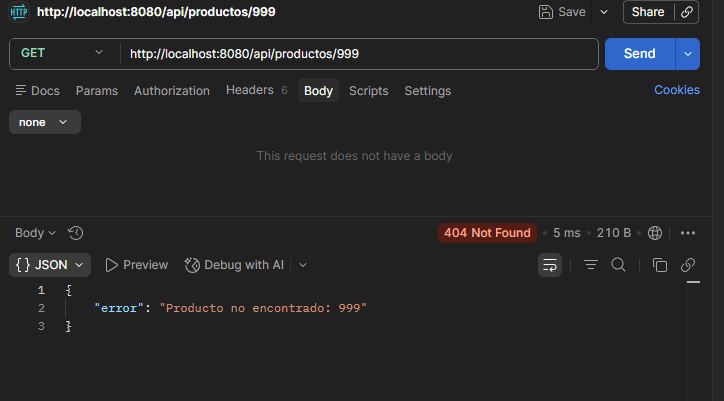

# API REST de Productos - Spring Boot

## Autor

- **Nombre:** Jhoseth Esneider Rozo Carrillo
- **Código:** 02230131027
- **Programa:** Ingeniería de Sistemas
- **Unidad:** 7 Spring Boot Básico
- **Actividad:** Post-Contenido 2
- **Fecha:** 19/04/2026

---

## Descripción del Proyecto

Este proyecto implementa una API REST CRUD para la gestión de productos utilizando Spring Boot.

La aplicación permite:

- Crear productos (POST)
- Consultar productos (GET)
- Actualizar productos (PUT)
- Eliminar productos (DELETE)

Se utilizan:

- `@RestController`
- `ResponseEntity`
- Persistencia en memoria (HashMap)
- Manejo global de errores con `@RestControllerAdvice`
- Pruebas con Postman

---

## Prerrequisitos

| Requisito | Detalle                 |
| --------- | ----------------------- |
| Java      | JDK 17 o superior       |
| Maven     | 3.8+ o usar `mvnw`      |
| Postman   | Para pruebas de la API  |
| IDE       | IntelliJ IDEA o VS Code |

---

## Ejecución del Proyecto

### 1️. Clonar repositorio

git clone https://github.com/jerc31/rozo-post2-u7.git
cd productos-web

### 2️. Ejecutar la aplicación

mvn spring-boot:run

### 3️. Verificar arranque

En consola debe aparecer:

Started ApiproductosApplication

---

### Tabla de Endpoints

Todos los endpoints están correctamente implementados:

| Método | URL                 | Código Éxito   | Código Error | Estado |
| ------ | ------------------- | -------------- | ------------ | ------ |
| GET    | /api/productos      | 200 OK         | —            | ✓      |
| GET    | /api/productos/{id} | 200 OK         | 404          | ✓      |
| POST   | /api/productos      | 201 Created    | 400          | ✓      |
| PUT    | /api/productos/{id} | 200 OK         | 404          | ✓      |
| DELETE | /api/productos/{id} | 204 No Content | 404          | ✓      |

---

### Pruebas con Postman

#### Listar productos (GET)

- GET /api/productos → 200 OK
  Retorna lista JSON con todos los productos

#### Crear producto (POST)

- POST /api/productos → 201 Created
  {
  "nombre": "Monitor",
  "descripcion": "Monitor 27 pulgadas 4K",
  "precio": 499.99
  }
  Respuesta incluye ID asignado

#### Actualizar producto (PUT)

- PUT /api/productos/4 → 200 OK
  {
  "nombre": "Monitor Curvo",
  "descripcion": "Monitor curvo 32 pulgadas QHD",
  "precio": 699.99
  }
  Actualización verificada correctamente

#### Eliminar producto (DELETE)

DELETE /api/productos/4 → 204 No Content

- GET /api/productos/4 → 404 Not Found (verificación post-eliminación)
  No HTML (Whitelabel)

---

### Manejo Global de Excepciones

- Clase `GlobalExceptionHandler` con `@RestControllerAdvice`
- Maneja `RuntimeException`
- Retorna respuesta JSON con error: `{"error": "Producto no encontrado: 999"}`
- Código HTTP correcto: 404 Not Found

---

### Checkpoints Cumplidos

✔ Proyecto arranca sin errores
✔ API responde JSON
✔ CRUD completo funcional
✔ Códigos HTTP correctos
✔ Manejo de errores en JSON
✔ Pruebas verificadas con Postman

---

### Estructura del Proyecto

- src/
- ├── controller/
- │ ├── ProductoApiController.java
- │ └── GlobalExceptionHandler.java
- ├── model/
- │ └── Producto.java
- ├── service/
- │ └── ProductoService.java
- └── resources/
-     └── application.properties

---

## Capturas de Pantalla

Las siguientes capturas se encuentran en la carpeta `/evidencias/`:

# Ejecuta sin errores en 1.274s

## Respuesta Json

## Listar productos con GET

## Crear producto con POST

## Actualizar producto con PUT

## PUT a producto con ID inexistente

## Eliminar producto existente - DELETE

## GET despues de DELETE

## GET 999

---

## Conclusión

La API REST cumple con todos los requerimientos:

Implementación correcta de endpoints CRUD
Uso adecuado de códigos HTTP
Manejo estructurado de errores
Verificación completa mediante Postman
